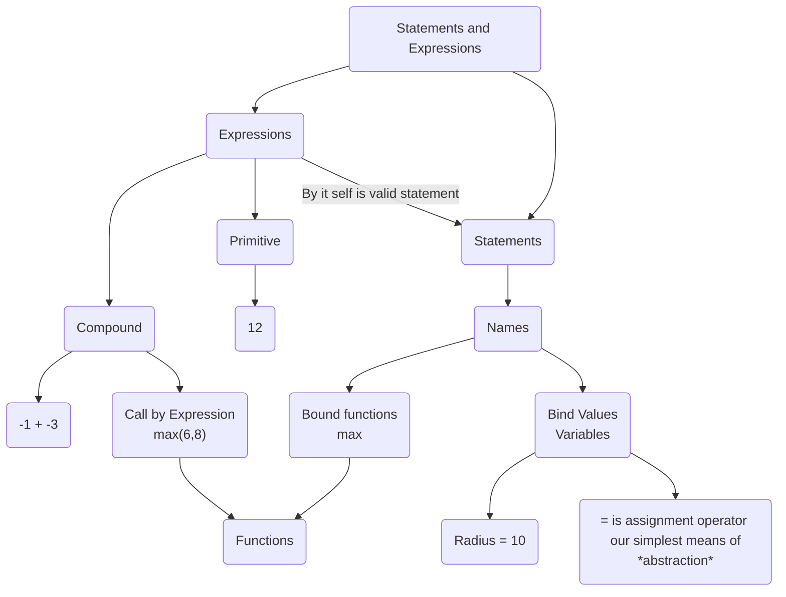

09-Mar-2022 | 17:48

Status: #SlipBox 
Tags: #CS #Python/Composing-Programs #FirstPT 

---
# Statement and expressions Flowchart

^27b438

```mermaid
graph TD

id2.1(Statements and Expressions)
id2.1.1(Expressions)
id2.1.2(Statements)
id3.1(Primitive)
id3.2(Compound)
id3.1.1(12)
id3.2.1("-1 + -3")
id3.2.2("Call by Expression <br/> max(6,8)")
id4(Functions)
id5(Names)
id5.2(Bound functions <br/> max)
id5.1(Bind Values <br/> Variables)
id5.1.1("Radius = 10")
id5.1.2(" = is assignment operator <br/> our simplest means of *abstraction*")

id2.1.1-- By it self is valid statement -->id2.1.2 
id2.1-->id2.1.1
id2.1-->id2.1.2
id2.1.1-->id3.1
id2.1.1-->id3.2
id3.1-->id3.1.1
id3.2-->id3.2.1
id3.2-->id3.2.2
id3.2.2-->id4
id2.1.2-->id5
id5-->id5.2
id5-->id5.1
id5.2-->id4
id5.1-->id5.1.1
id5.1-->id5.1.2

class id4,id2.1.2 internal-link;
```

---
# Reference

[[Expressions]]
[[Statements]]

