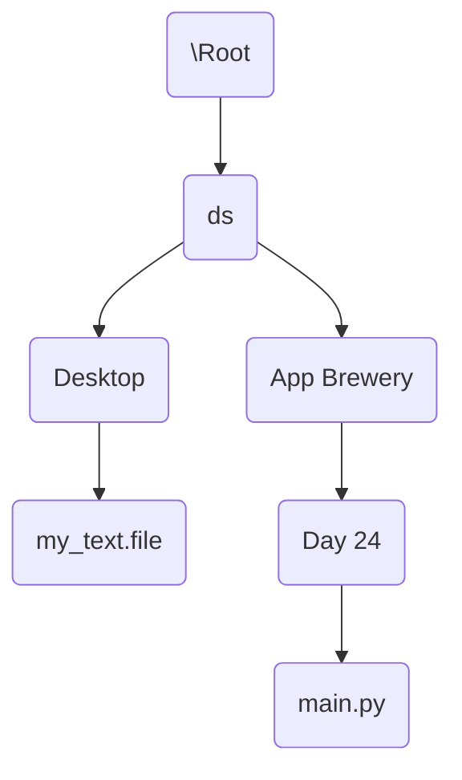

`10-Apr-2022 | 07:51`

---
# operating with file system

Getting relative path. 

From $main.py$  to access relative path of $/Desktop/my_text.file$

first $../$ makes working directory as $App Brewery$ 
next ../ makes working directory as $ds$  and this is where the common branch of the two files we are working, so now get into the path of file to be accessed, so 

from $main.py$ relative path to $my_file.txt$ will be 

$../../Desktop/my-file.txt$

---
# Reference
[[Computational Thinking MOC]]

Day 24 - [App Brewery](https://www.udemy.com/course/100-days-of-code/)
